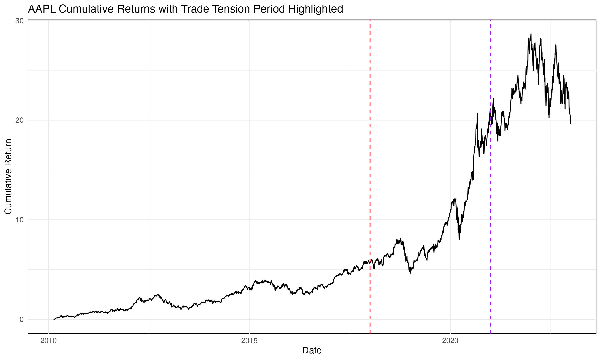
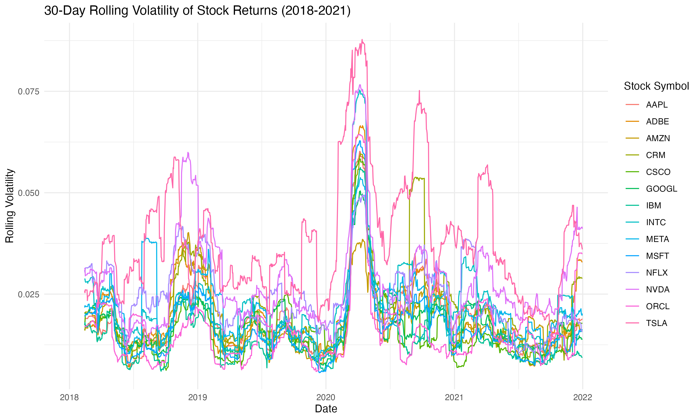

# Market Volatility Analysis: US-China Trade Tensions (2018-2020)

## Overview

This R project is designed to explore market volatility in the context of US-China trade tensions between 2018 and 2020. It provides a comprehensive analysis of technology stocks, highlighting how geopolitical events influenced market performance and volatility. The project is ideal for those interested in financial analysis, data science, and economic impacts of international relations.

## Data Sources

Datasets used in this analysis are:

- S&P 500 historical data: [Kaggle](https://www.kaggle.com/datasets/henryhan117/sp-500-historical-data).
- Big Tech stock prices: [Kaggle](https://www.kaggle.com/datasets/evangower/big-tech-stock-prices).

## Components

- **Event Studies**: Analysis of stock performance surrounding key trade tension events.
- **Risk-Return Analysis**: Examines return patterns across different stocks.
- **Volatility Measurements**: Utilizes GARCH models for market risk assessment.
- **Liquidity Analysis**: Investigates market liquidity changes due to trade events.
- **Portfolio Simulation**: Analyzes overall performance of a tech stock portfolio.

## Visualizations

Key visualizations generated:

### Event Study Analysis

Abnormal returns around trade-related events.  


### Cumulative Returns

Cumulative returns for a tech stock, highlighting trade tension impacts.  


### Rolling Volatility

Displays tech stocks' rolling volatility from 2018 to 2021.  


## Prerequisites

Ensure R is installed with packages: `dplyr`, `tidyr`, `ggplot2`, `xts`, `rugarch`, etc.

## Running the Analysis

1. Clone/download the repository.
2. Load datasets into R from Kaggle.
3. Execute the R scripts in the presented order.

## GARCH Model Usage

For GARCH modeling, here's an example, using AAPL stock data:

```R
# Load the rugarch package
library(rugarch)

# Filter AAPL data, run GARCH Model, plot volatility
aapl_data <- filter(data, stock_symbol == "AAPL")
garch_fit_aapl <- runGarchModel(aapl_data)
plotVolatility(garch_fit_aapl)
```

## Deployment

* Execute analysis on any R-enabled machine. No special deployment steps required unless integrating into a Shiny app or similar platforms.

